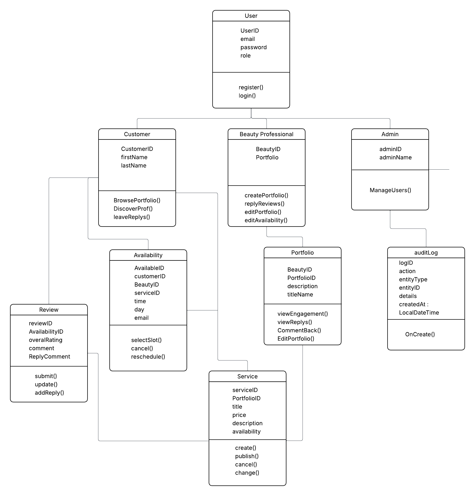

# GlowUP - Backend API Documentation

**Base URL:** `http://localhost:8080/api`

---

## Table of Contents

1. [Overview](#1-overview)
2. [User Roles](#2-user-roles)
3. [UML Class Diagram](#3-uml-class-diagram)
4. [API Endpoints](#4-api-endpoints)
   - [Customer Management](#customer-management)
   - [Beauty (Provider) Management](#beauty-provider-management)
   - [Service Management](#service-management)
   - [Portfolio Management](#portfolio-management)
   - [Availability Management](#availability-management)
   - [Review Management](#review-management)
   - [Admin Management](#admin-management)
   - [Audit Logs](#audit-logs)
5. [Use Case Mapping](#5-use-case-mapping)

---
## 1. Overview

The GlowUP API back-end API provides an interface for managing :

- **User Accounts**: Customer, Beauty Professionals, and Admin roles
- **Beauty Professionals Accounts**: Allowing Beauty Professionals to store their portfolio and their information/availability.
- **Portfolio**: Portfolio that is maintained by Professional and contains their description.
- **Availability**: Professionals availability that is inspected by the customer.
- **Reviews**: Customer feedback after session with the Professional
- **Audit-Logs**: Admin maintains the system settings

---
## 2. User Roles

This API supports three main roles

| Role | Description | Primary Responsibilities |
|------|-------------|-------------------------|
| **CUSTOMER** | Consumer of beauty services, Browse portfolio, reviews, select service availability |
| **BEAUTY-PROFESSIONAL** | Provider for beauty services, Manage portfolio/availability, Respond to reviews |
| **ADMIN** | Platform administrator | Manage access, moderate content, view analytics |

---
## 3. UML Class Diagram



## 4. API Endpoints

These use-cases are use specifically with the endpoints ('/customer', '/beauty', '/admin')

### Customer Use Cases
#### Create Customer

**Endpoint:** `POST /customers`
**Use Case:** US-CUST-001 (Register as Customer)
**Description:** Create a new customer account with profile information.

```http
POST /customer
Content-Type: application/json

{
  "firstName": "Lily",
  "lastName": "Star",
  "email": "lily@email.com",
  "password": "123456"
}
```

**Response:**
```json
{
  "firstName": "Lily",
  "lastName": "star",
  "email": "lily@email.com",
  "password": "123456"
}
```

**Status Code:** `201 Created`

---

#### Get All Customers
**Endpoint:** `GET /customers`
**Use Case:** US-CUST-002 (View All Customers (Admin use))
**Description:** Retrieve all customer accounts.

```http
GET /customers
```

**Status Code:** `200 OK`

---
#### Get Customer by ID
**Endpoint:** `GET /customers/{id}`
**Use Case:** US-CUST-003 (View Customer by ID)
**Description:** Retrieve specific customer by ID.

```http
GET /customers/1
```

**Status Code:** `200 OK` or `404 Not Found`

---
#### Get Customer by email
**Endpoint:** `GET /customers/email/{email}`
**Use Case:** US-CUST-004 (View Customer by Email)
**Description:** Retrieve specific customer by email.

```http
GET /customers/email/"lily@gmail.com"
```

**Status Code:** `200 OK` or `404 Not Found`

---
#### Update customer
**Endpoint:** `PUT /customers/'{id}'
**Use Case:** US-CUST-005 (Update Customer Profile)
**Description:** Update customer profile

```http
PUT /customers/'{id}'
```

**Status Code:** `200 OK` or `404 Not Found`

---

#### Delete Customer
**Endpoint:** `DELETE /customers/'{id}'
**Use Case:** US-CUST-006 (Delete Customer)
**Description:** Delete customer profile

```http
DELETE /customers/'{id}'
```

**Status Code:** `200 OK` or `404 Not Found`

--- 

### Review Management

#### Creating a professional account
**Endpoint:** `POST /beauties`
**Use Case:** US-reviews-001 (Creating a review)
**Description:** Create a new beauty professional account

```http
POST /beauties
Content-Type: application/json

{
  "businessName": "Glow Studio",
  "specialty": "Makeup",
  "email": "beauty@email.com",
  "password": "123456"
}
```

**Response:**
```json
{
  "businessName": "Glow Studio",
  "specialty": "Makeup",
  "email": "beauty@email.com",
  "password": "123456"
}
```

**Status Code:** `201 Created`
---

#### Get All Beauties
**Endpoint:** `GET /beauties`
**Use Case:** US-CUST-006 (Delete Customer)
**Description:** Retrieve all beauties accounts.

```http
GET /beauties
```

**Status Code:** `200 OK` or `404 Not Found`

---

#### Get Beauties by id
**Endpoint:** `GET /beauties/'{id}'`
**Use Case:** US-BEAUTY-003 (View Beauty by ID)
**Description:** Retrieve a specific beauty account

```http
GET /beauties/{id}
```

**Status Code:** `200 OK` or `404 Not Found`

---

#### Delete a Beauty account
**Endpoint:** `DELETE /beauties/'{id}'`
**Use Case:** US-BEAUTY-004 (Delete Beauty Account)
**Description:** Deleting a specific beauty account

```http
DELETE /beauties/{id}
```

**Status Code:** `200 OK` or `404 Not Found`

---
### Service Management

#### Create Beauty account
**Endpoint:** `POST /services`
**Use Case:** US-Services-001 (Posting a Service)
**Description:** Creating a service

```http
POST /services
Content-Type: application/json

{
  "name": "Glow Studio",
  "price": 50.0,
  "description": "lily@email.com",
  "beauty": {
   "userID" : 1
  }
}
```

**Response:**
```json
{
  "name": "Glow Studio",
  "price": 50.0,
  "description": "lily@email.com",
  "beauty": {
   "userID" : 1
  }
}
```

**Status Code:** `201 Created`

---

#### Get all Services
**Endpoint:** `GET /services`
**Use Case:** US-SERVICE-002 (View All Services)
**Description:** Getting all services

```http
GET/services
```

**Status Code:** `200 OK` or `404 Not Found`
---

#### Get services by ID
**Endpoint:** `GET /services/{id}`
**Use Case:** US-SERVICE-003 (View Service by ID)
**Description:** Getting a specific service by id

```http
GET/services/{id}
```

**Status Code:** `200 OK` or `404 Not Found`

---

#### Update services
**Endpoint:** `PUT /services/{id}`
**Use Case:** US-SERVICE-004 (Update Service)
**Description:** Updating a specific service with id

```http
PUT/services/{id}
```

**Status Code:** `200 OK` or `404 Not Found`
---

#### Deleting a service with id
**Endpoint:** `DELETE /services/{id}`
**Use Case:** US-SERVICE-005 (Delete Service)
**Description:** Deleting a specific service with id

```http
DELETE/services/{id}
```

**Status Code:** `200 OK` or `404 Not Found`
---

### Review Management

#### Creating a review post
**Endpoint:** `POST /reviews`
**Use Case:** US-REVIEW-001 (Create Review)
**Description:** Create a new review

```http
POST /reviews
Content-Type: application/json

{
  "rating": 5,
  "comment": "Amazing service!",
  "beauty": {
    "userId": 1
  },
  "service": {
    "serviceId": 1
  }
}
```

**Response:**
```json
{
   "rating": 5,
  "comment": "Amazing service!",
  "beauty": {
    "userId": 1
  },
  "service": {
    "serviceId": 1
  }
}
```

**Status Code:** `201 Created`
---

#### Get all reviews
**Endpoint:** `GET /reviews`
**Use Case:** US-REVIEW-002 (View All Reviews)
**Description:** Getting all reviews

```http
GET/reviews
```

**Status Code:** `200 OK` or `404 Not Found`
---

#### Get review by ID
**Endpoint:** `GET /reviews/{id}`
**Use Case:** US-REVIEW-003 (View Review by ID)
**Description:** Getting a specific review with id

```http
GET/reviews/{id}
```

**Status Code:** `200 OK` or `404 Not Found`
---

#### Update review 
**Endpoint:** `PUT/reviews/{id}`
**Use Case:** US-REVIEW-004 (Update Review (Reply))
**Description:** Updating a specific review with id

```http
GET/reviews/{id}
{
   "replyText": "Thank you!"
}
```

**Status Code:** `200 OK` or `404 Not Found`
---

#### Delete review
**Endpoint:** `DELETE/reviews/{id}`
**Use Case:** US-REVIEW-005 (Delete Review)
**Description:** Deleting a specific review with id

```http
DELETE/reviews/{id}

```

**Status Code:** `200 OK` or `404 Not Found`
---


### Portfolio management

#### Creating a portfolio
**Endpoint:** `POST /portfolios`
**Use Case:** US-portfolios-001 (Creating a portfolio)
**Description:** Create a new portfolio

```http
POST /portfolios
Content-Type: application/json

{
  "titleName": "Bridal Looks",
  "description": "Wedding makeup",
  "beauty": {
    "userId": 1
  }
}
```

**Response:**
```json
{
  "titleName": "Bridal Looks",
  "description": "Wedding makeup",
  "beauty": {
    "userId": 1
  }
}
```

**Status Code:** `201 Created`
---

#### Get all portfolios
**Endpoint:** `GET/portfolios`
**Use Case:** US-PORTFOLIO-002 (View All Portfolios)
**Description:** Getting all portfolios

```http
GET/portfolios

```

**Status Code:** `200 OK` or `404 Not Found`
---

#### Delete availability 
**Endpoint:** `GET/portfolios/{id}`
**Use Case:** US-PORTFOLIO-003 (View Portfolio by ID)
**Description:** Getting a specific portfolio with id

```http
GET/portfolios/{id}

```

**Status Code:** `200 OK` or `404 Not Found`

---

#### Update portfolio
**Endpoint:** `PUT/portfolios/{id}`
**Use Case:** US-PORTFOLIO-004 (Update Portfolio)
**Description:** Updating portfolio with id

```http
PUT/portfolios/{id}

```

**Status Code:** `200 OK` or `404 Not Found`
---

#### Delete portfolio
**Endpoint:** `DELETE/portfolios/{id}`
**Use Case:** US-PORTFOLIO-005 (Delete Portfolio)
**Description:** Deleting a specific portfolio

```http
DELETE/portfolios/{id}

```

**Status Code:** `200 OK` or `404 Not Found`
---

### Availability management

#### Creating a availability
**Endpoint:** `POST /availabilities`
**Use Case:** US-AVAIL-001 (Create Availability)
**Description:** Create a new availability

```http
POST /availabilities
Content-Type: application/json

{
 "date": "2026-04-01",
  "time": "10:00 AM",
  "beauty": {
    "userId": 1
  }
}
```

**Response:**
```json
{
 "date": "2026-04-01",
  "time": "10:00 AM",
  "beauty": {
    "userId": 1
  }
}
```

**Status Code:** `201 Created`
---

#### Get all availabilities
**Endpoint:** `GET/availabilities`
**Use Case:** US-AVAIL-002 (View All Availabilities)
**Description:** Getting all availabilities

```http
GET/portfolios

```

**Status Code:** `200 OK` or `404 Not Found`
---

#### Getting availability by beauty
**Endpoint:** `GET/availabilities/beauty/{beautyId}`
**Use Case:** US-AVAIL-003 (View Availability by Beauty)
**Description:** Getting a specific availability by beautyID

```http
GET /availabilities/beauty/{beautyId}

```

**Status Code:** `200 OK` or `404 Not Found`
---

#### Deleting availability
**Endpoint:** `DELETE/availabilities/{id}`
**Use Case:** US-AVAIL-004 (Delete Availability)
**Description:** Deleting a specific availability

```http
DELETE /availabilities/{id}

```

**Status Code:** `200 OK` or `404 Not Found`
---

### Admin management

#### Creating an admin
**Endpoint:** `POST /admins`
**Use Case:** US-admins-001 (Creating an admin)
**Description:** Create an admin

```http
POST /admins
Content-Type: application/json

{
 "adminName": "System Admin",
  "email": "admin@email.com",
  "password": "admin123"
}
```

**Response:**
```json
{
 "adminName": "System Admin",
  "email": "admin@email.com",
  "password": "admin123"
}
```

**Status Code:** `201 Created`
---

#### Getting all admins
**Endpoint:** `GET/admins`
**Use Case:** US-ADMIN-002 (View All Admins)
**Description:** Getting all admins

```http
GET /admins

```

**Status Code:** `200 OK` or `404 Not Found`

---

#### Getting admin by ID
**Endpoint:** `GET/admins/{id}`
**Use Case:** US-ADMIN-003 (View Admin by ID)
**Description:** Getting a specific admin through id

```http
GET /admins/{id}

```

**Status Code:** `200 OK` or `404 Not Found`

---

#### Deleting admin
**Endpoint:** `DELETE/admins/{id}`
**Use Case:** US-ADMIN-004 (Delete Admin)
**Description:** Deleting an admin 

```http
Delete /admins/{id}

```

**Status Code:** `200 OK` or `404 Not Found`


---
### AuditLog management

#### Creating an Auditlog
**Endpoint:** `POST /auditlogs`
**Use Case:** US-AUDIT-001 (Create Audit Log)
**Description:** Create an auditlog

```http
POST /auditlogs
Content-Type: application/json

{
"action": "DELETE",
  "entityType": "SERVICE",
  "entityId": 5,
  "details": "Removed inappropriate service",
  "admin": {
    "userId": 1
  }
}
```

**Response:**
```json
{
 "action": "DELETE",
  "entityType": "SERVICE",
  "entityId": 5,
  "details": "Removed inappropriate service",
  "admin": {
    "userId": 1
  }
}
```

**Status Code:** `201 Created`

---

#### Getting all logs
**Endpoint:** `GET/auditlogs`
**Use Case:** US-AUDIT-002 (View All Audit Logs)
**Description:** Getting all auditlogs

```http
GET /auditlogs

```

**Status Code:** `200 OK` or `404 Not Found`


---

#### Getting logs by admin
**Endpoint:** `GET/auditlogs/admin/{adminId}`
**Use Case:** US-AUDIT-003 (View Logs by Admin)
**Description:** Getting auditlogs with adminID

```http
GET /auditlogs/admin/{adminId}

```

**Status Code:** `200 OK` or `404 Not Found`

---
## 5. Use Case Mapping

The API endpoints are meant to follow these SRS use cases : 

| Use Case | Description | Related Endpoints |
|----------|-------------|-------------------|
| **US-CUST-001** | Register & manage customer profile | `POST /customers`, `PUT /customers/{id}`, `GET /customers/{id}`, `DELETE /customers/{id}` |
| **US-CUST-002** | View available services | `GET /services`, `GET /services/{id}` |
| **US-CUST-003** | Write and view reviews for services | `POST /reviews`, `GET /reviews/{id}`, `GET /reviews` |
| **US-CUST-004** | View beauty professionals | `GET /beauties`, `GET /beauties/{id}` |

| **US-BEAUTY-001** | Register & manage beauty profile | `POST /beauties`, `PUT /beauties/{id}`, `GET /beauties/{id}`, `DELETE /beauties/{id}` |
| **US-BEAUTY-002** | Create and manage services | `POST /services`, `PUT /services/{id}`, `DELETE /services/{id}`, `GET /services` |
| **US-BEAUTY-003** | Manage portfolio | `POST /portfolios`, `PUT /portfolios/{id}`, `DELETE /portfolios/{id}`, `GET /portfolios` |
| **US-BEAUTY-004** | Set and manage availability | `POST /availabilities`, `GET /availabilities`, `GET /availabilities/beauty/{beautyId}`, `DELETE /availabilities/{id}` |
| **US-BEAUTY-005** | Respond to reviews | `PUT /reviews/{id}` |

| **US-ADMIN-001** | Manage users (view/update/delete) | `GET /customers`, `GET /beauties`, `GET /admins`, `DELETE /customers/{id}`, `DELETE /beauties/{id}`, `DELETE /admins/{id}` |
| **US-ADMIN-002** | Moderate services | `GET /services`, `DELETE /services/{id}` |
| **US-ADMIN-003** | Moderate reviews | `GET /reviews`, `DELETE /reviews/{id}` |
| **US-ADMIN-004** | Track system activity (audit logs) | `POST /auditlogs`, `GET /auditlogs`, `GET /auditlogs/admin/{adminId}` |